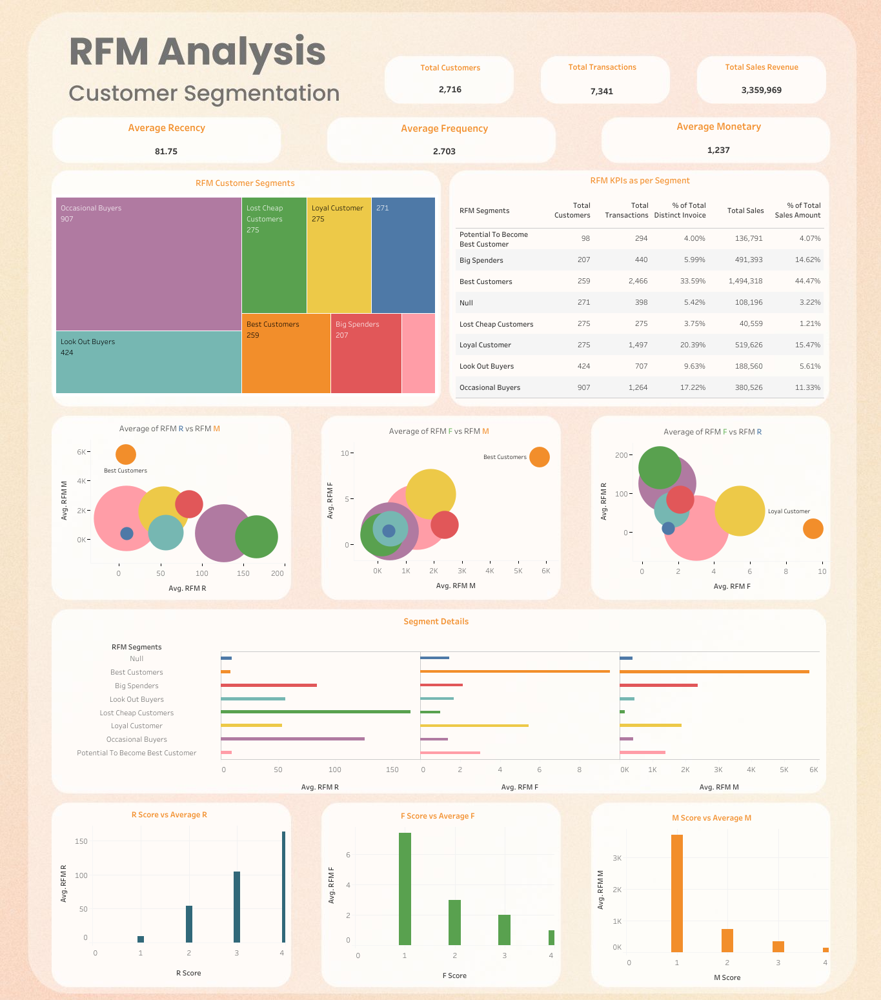

# **Project Introduction**

This project involved creating a Tableau dashboard for RFM (Recency, Frequency, Monetary) analysis, a widely recognized marketing technique for customer segmentation. 
This method categorizes customers based on their recent purchases (recency), the regularity of their transactions (frequency), and the total amount they spend (monetary value), allowing for a granular understanding of customer value and behavior.
# **Project Details**

Click the link to view the <a href="https://public.tableau.com/app/profile/aniketghatak/viz/RFManalysis_17301205701620/RFMAnalysis">
Tableau dashboard 

</a>

Note:

    The dashboard is made in Tableau.
