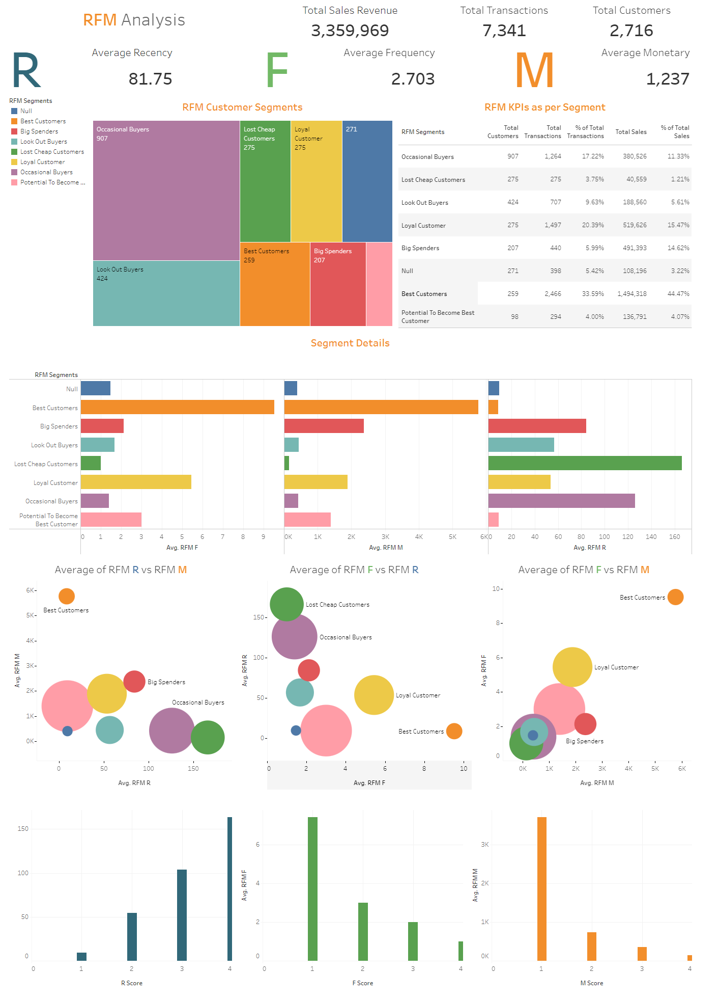

# **Project Introduction**

In this project I have created a dashboard in Tableau about RFM analysis of a company's consumer behavior.

RFM analysis is a marketing technique that groups and ranks customers based on their purchase behavior. RFM stands for recency, frequency, and monetary value:

Recency: How recently a customer made a purchase.

Frequency: How often a customer makes purchases.

Monetary value: How much a customer spends on a brand's products and services.

# **Project Details**

Click the link to view the <a href="https://public.tableau.com/app/profile/aniketghatak/viz/RFManalysis_17301205701620/Dashboard1">
Tableau dashboard 

</a>

Note:

    The dashboard is made in Tableau.
